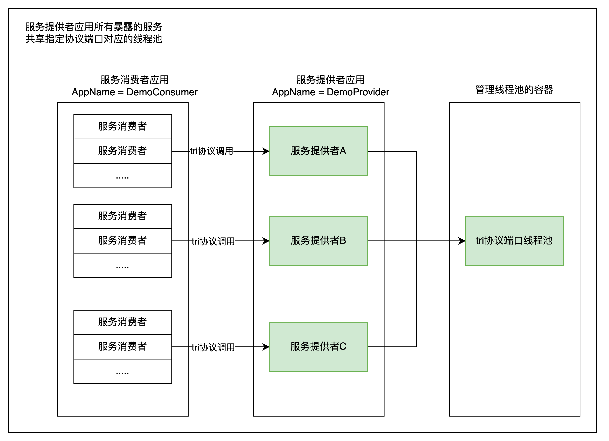
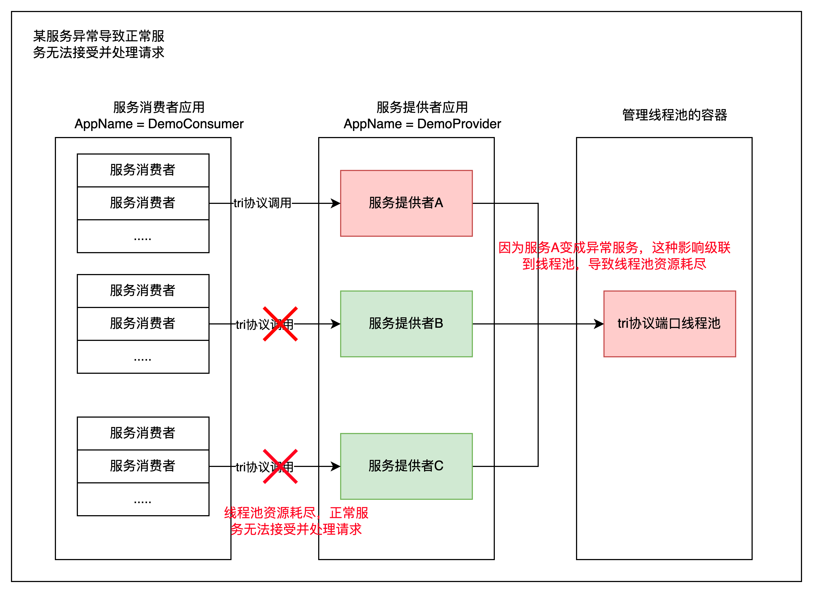
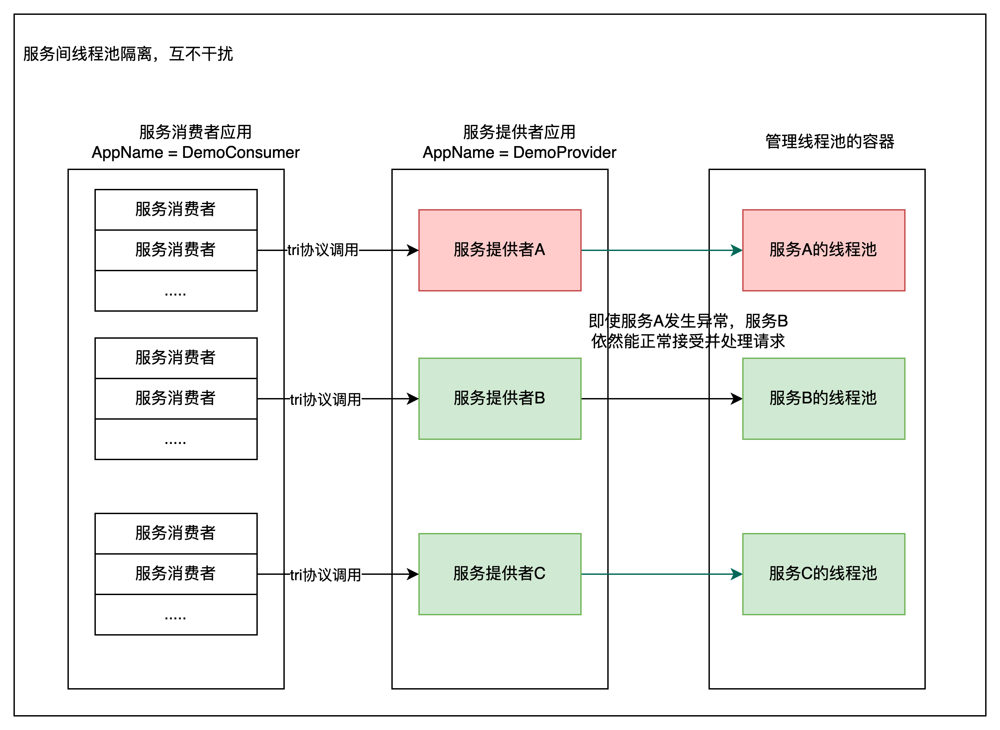

# 概述

## 线程池

一个提供者应用暴露服务有两个关键步骤
- 服务信息写入注册中心
- 开启监听指定协议端口的服务器

步骤2开启监听服务器的时候同时创建线程池，当消费者应用向提供者应用发起rpc请求的时候，会把rpc请求投递给线程池处理。

## 现状
目前线程池的设计是以**协议端口为粒度**的，假设某个提供者应用以 `triple` 协议暴露了多个服务，此时会以`triple` 协议配置的port为唯一键创建对应的线程池，即**不管该提供者应用暴露了多少个服务，都只会创建并共享这一个线程池**。当消费者应用向提供者应用的不同服务发起rpc调用的时候，在提供者的服务器这一侧，都会把请求投递到这个线程池去处理。

## 问题
倘若，提供者应用某个服务因为各种因素出现了问题，比如该服务处理请求的响应时间变长，而某个消费者还在不停地、高并发地调用这个服务，就会使得这个**异常服务把整个线程池都占满**了！而提供者应用还有其他正常的服务，但是因为线程池资源被异常服务耗尽导致其他正常的服务不能接受消费者的请求。

## 优化
因此需要引入一种**新的线程池管理方式**，使得应用内**各个服务的线程池隔离开来，互相独立**，某个服务的线程池资源耗尽不会影响其他正常服务。同时要支持**线程池可配置化**，由用户手动指定。

# 隔离线程池优化思路

## 管理线程池的容器

### 线程池容器
回到dubbo工程代码中，如下，我们发现提供者线程池是统一收敛在 `DefaultExecuteRepository` 中的核心容器 `data` 管理的 ，该 `data` 就存储了所有的线程池。
为了方便理解，只关注 `data` 的二级KV即可，即 `ConcurrentMap<Integer, ExecutorService>` 这部分。

```java
public class DefaultExecutorRepository implements ExecutorRepository, ExtensionAccessorAware {

    private final ConcurrentMap<String, ConcurrentMap<Integer, ExecutorService>> data = new ConcurrentHashMap<>();
}
```

### 线程池的存储
#### 原有逻辑
线程池的创建和存储主要是调用了如下方法，`data` 作为一个 `Map` 容器，**针对提供者**，Map 的 二级 **key 为协议的端口**，Map 的 **value 是由协议配置信息构建的线程池**。如下可以看到线程池存入的过程。
```java
// DefaultExecutorRepository#createExecutorIfAbsent
public synchronized ExecutorService createExecutorIfAbsent(URL url) {
        String executorKey = getExecutorKey(url);
        Map<Integer, ExecutorService> executors = data.computeIfAbsent(executorKey, k -> new ConcurrentHashMap<>());
        // Consumer's executor is sharing globally, key=Integer.MAX_VALUE. Provider's executor is sharing by protocol.
        Integer portKey = CONSUMER_SIDE.equalsIgnoreCase(url.getParameter(SIDE_KEY)) ? Integer.MAX_VALUE : url.getPort(); // 注意这里，Map 的 二级 key 为协议的端口

        URL finalUrl = url;
        ExecutorService executor = executors.computeIfAbsent(portKey, k -> createExecutor(finalUrl)); // 注意这里，Map 的 value 是由协议配置信息构建的线程池
        return executor;
    }
```
#### 优化逻辑
想要做到提供者应用的服务间线程池隔离，我们可以将 **data容器的二级key设置为各个服务的三元组， value设置为由用户给服务指定的线程池。**（三元组即`interfaceName + version + group`，可以用 `url.serviceKey()` 获取，若用户未指定线程池则可以根据协议配置构建默认线程池）。

### 线程池的获取

#### 原有逻辑
如下是原有线程池的获取逻辑，以协议端口为二级key来获取先前缓存的线程池。
```java
// DefaultExecutorRepository#getExecutor
public ExecutorService getExecutor(URL url) {
        Map<Integer, ExecutorService> executors = data.get(getExecutorKey(url));
        // Consumer's executor is sharing globally, key=Integer.MAX_VALUE. Provider's executor is sharing by protocol.
        Integer portKey = CONSUMER_SIDE.equalsIgnoreCase(url.getParameter(SIDE_KEY)) ? Integer.MAX_VALUE : url.getPort();
        ExecutorService executor = executors.get(portKey);
        return executor;
    }

```
#### 优化逻辑
想要做到提供者应用的服务间线程池隔离，我们可以 **以各个服务的三元组为二级key** 从data容器中取出先前缓存的线程池。

### 备注
为了方便后面描述，`DefaultExecuteRepository#createExecutorIfAbsent` 记作 `createExecutorIfAbsent` ，`DefaultExecutorRepository#getExecutor` 记作 `getExecutor`。

**同时为了后面流程的理解，我们要先把 `createExecutorIfAbsent` 和 `getExecutor` 当做是已经优化后、以服务间隔离的方式创建和获取线程池的。**


## 隔离线程池的存储时机

隔离线程池的存储其实就是通过调用上面的 `createExecutorIfAbsent` 方法进行存储的。 只是 `dubbo` 协议和 `triple` 协议在暴露服务的流程中，调用 `createExecutorIfAbsent` 方法的时机略有不同，下面针对这两种协议简单梳理下调用时机。

### dubbo协议
假设某个提供者应用以 `dubbo` 协议暴露了两个服务，会挨个调用 `ServiceConfig.export`，第一个服务最后会创建监听服务器 `server`，
并以应用所在机器的 **address 作为key, server 做为 value** 缓存起来，这样做的目的是同一个机器只开启一个监听服务器。

```java
// DubboProtocol#openServer
private void openServer(URL url) {
        checkDestroyed();
        // find server.
        String key = url.getAddress(); // 注意这里，address作为serverMap缓存的key 
        ProtocolServer server = serverMap.get(key);
        if (server == null) {
            synchronized (this) {
                server = serverMap.get(key);
                if (server == null) {
                    serverMap.put(key, createServer(url)); // 注意这里，createServer(url) 会创建并返回监听服务器server，server作为serverMap缓存的value
                    return;
                }
            }
            // server supports reset, use together with override
            server.reset(url); // 注意这里，当address缓存命中后，不会在创建server，而是调用 reset，后面会解释该方法作用
        }
    }
```

`createServer(url)` 其实就创建了一个 `NettyServer`，也即下面代码片段的 `AbstractServer`，`AbstractServer`内部会调用 `createExecutorIfAbsent` ，
这就是我们找的时机。 `createExecutorIfAbsent`即像前一小节描述的，会创建 url 对应服务的线程池。

同时这里注意 `AbstractServer` 传入的 `url` 为第一个服务的 `url` ，**且`server` 只存储第一个暴露服务对应的 `url` 引用**，这里有一个印象即可，后面在**隔离线程池的获取**小节会分析这一点。
```java
public AbstractServer(URL url, ChannelHandler handler) throws RemotingException {
        super(url, handler);
        // ...
        executors.add(executorRepository.createExecutorIfAbsent(url)); // 注意这里
    }
```

再看暴露第二个服务的流程，（对照前面`DubboProtocol#openServer`代码片段）也会去尝试开启监听服务器 `server`，但是因为 `address` 缓存命中，因此不会再次重复创建 `server`，
但是会调用 `server.reset(url)` 方法，该方法代码片段如下，也会调用 `createExecutorIfAbsent`，以及将当前服务的 url 参数以若存在则覆盖的方式合并到第一个服务 url 的参数列表上。但要注意 **监听服务器 server 存的还是第一个服务的url，三元组信息保留的还是第一个服务的url的**。

```java
// DubboProtocol#reset
public void reset(URL url) {
        ExecutorService executor = executorRepository.createExecutorIfAbsent(url); // 注意这里，调用实际
        executors.add(executor);
        executorRepository.updateThreadpool(url, executor);
        super.setUrl(getUrl().addParameters(url.getParameters())); // 注意这里，将当前服务的 url 参数以若存在则覆盖的方式合并到第一个服务 url 的参数列表上
    }
```

`createExecutorIfAbsent` 方法的两处调用时机前面已经分析完了。我们可以得到的结论是，dubbo 协议暴露 n 个服务，就会调用 n 次 `createExecutorIfAbsent` 方法，也正好会创建各自服务隔离的线程池。

### triple协议
再看 `triple` 协议，还是以前面暴露两个服务为例，两个服务在暴露的流程中，都会走到 `TripleProtocol#export` ，并调用 `createExecutorIfAbsent` 来创建线程池。

`TripleProtocol#export` 如下
```java
public <T> Exporter<T> export(Invoker<T> invoker) throws RpcException {
        URL url = invoker.getUrl();
        String key = serviceKey(url);
        final AbstractExporter<T> exporter = new AbstractExporter<T>(invoker) {
            @Override
            public void afterUnExport() {
                // ...
            }
        };

        exporterMap.put(key, exporter);

        url.getOrDefaultApplicationModel().getExtensionLoader(ExecutorRepository.class)
            .getDefaultExtension()
            .createExecutorIfAbsent(url); // 注意这里
;
        return exporter;
    }
```

### 结论&优化思路
可以发现不管是 `dubbo` 协议还是 `triple` 协议，**暴露 n 个服务，就会调用 n 次 `createExecutorIfAbsent(url)` 方法**，而该方法每次传入 `url` 参数包含了对应服务的三元组信息，
因此只需要简单改造下  `createExecutorIfAbsent` 方法 ，**从url提取到服务的三元组信息，以及从url提取到用户配置的线程池**，然后存储到 `data` 容器，就做到了服务间的线程池隔离。

## 隔离线程池的获取时机

前面说了服务暴露在 `dubbo` 和 `triple` 协议下线程池的存储时机（即调用`createExecutorIfAbsent`方法的时机） 。这里再来看一下在这两种协议下，
当服务提供者收到rpc请求的时候是**怎么获取线程池**来处理请求的，也就是在何时调用 `getExecutor` 方法的。


### dubbo协议

看如下代码片段，可以看到调用了 `executorRepository.getExecutor(url)` ，内部会使用 `url.serviceKey` 三元组信息获取对应服务的线程池。
我们需要特别关注一下这个 `url` ，该 `url` 是 `WrappedChannelHandler` 的属性，其实就是前面提到的开启监听服务器 `server` 里面的 `url` 属性，
但是像前面的提到的，在暴露两个服务的时候，`server`的 `url` 保留的是一个服务的 `url` ， 只是参数是融合/覆盖了多个服务的（前面 `server.reset`方法 ）。
所以有一个很严重的问题，**该 url 的三元组信息是第一个暴露服务的三元组信息**，这样在**收到第二个服务请求的时候实际是拿到的第一个服务的线程池**！
虽然我们前面通过改造 `createExecutorIfAbsent`方法，在 `data` 容器里面的确存了各自服务隔离的线程池。

不过仔细观察下面`getPreferredExecutorService`方法的参数 `Object msg` ，`msg` 其实就是网络数据包信息，里面是含有各自服务的三元组信息的！
因此我们当我们想要使用服务间线程池隔离模式的时候，不能直接使用如下的 `url`，而是提取网络包数据的三元组信息 构建新的 `url` 然后调用 `executorRepository.getExecutor(url)`  从 data容器获取对应服务的线程池。

特殊说明，`Object msg` 的三元组是实际放在 `Request#mdata` 这部分未解码的消息体里的，因此必须要解码才能拿到三元组信息，而解码工作原先默认是放在 **各自服务隔离的线程池** 去做的，
但是我们本身的目的又是去获取隔离线程池，这里就发生了矛盾，所以不得不做出一种让步，当使用服务间线程池隔离模式的时候，则需要在 `netty io` 线程进行解码。

```java

// WrappedChannelHandler#getPreferredExecutorService
public ExecutorService getPreferredExecutorService(Object msg){
        if(msg instanceof Response){
            // ...
        }else{
            return getSharedExecutorService();
        }
}

// WrappedChannelHandler#getSharedExecutorService
public ExecutorService getSharedExecutorService() {
        // note: url.getOrDefaultApplicationModel() may create new application model
        ApplicationModel applicationModel = url.getOrDefaultApplicationModel();

        ExecutorRepository executorRepository =
        applicationModel.getExtensionLoader(ExecutorRepository.class).getDefaultExtension();

        // 注意这里，各个不同的服务都会使用第一个服务 url.serviceKey 三元组信息获取第一个服务服务的线程池，所以不能使用该url
        ExecutorService executor = executorRepository.getExecutor(url); 

        if (executor == null) {
        executor = executorRepository.createExecutorIfAbsent(url);
        }

        return executor;
}
```

### triple协议

看下面 `TripleHttp2Protocol#lookupExecutor` 代码片段，`triple` 在服务器开启的时候就**根据第一个服务的 url 构建executor** 并设置到了
`TripleHttp2FrameServerHandler#executor`属性，后续各个不同的服务都会使用这个 `executor` ，显然这个也不能用于服务间的线程池隔离。

但是注意下面`TripleHttp2FrameServerHandler#onHeadersRead`方法的参数`Http2HeadersFrame msg` ，这也是网络数据包，里面也维护了服务的三元组信息，
我们只需要提取网络包的三元组信息构建新的 `url` 然后调用 `executorRepository.getExecutor(url)` ，就可以从 `data` 容器获取对应服务的线程池。
而`Http2HeadersFrame msg` 是rpc请求的头部信息，里面就含有了三元组信息，直接就可以拿到。不像 `dubbo` 协议那样，还要提前在 `netty io` 线程中对 `Request#mdata` 解码。

```java
// TripleHttp2Protocol#lookupExecutor
private Executor lookupExecutor(URL url) {
    return url.getOrDefaultApplicationModel()
    .getExtensionLoader(ExecutorRepository.class)
    .getDefaultExtension().getExecutor(url);
    }
    
// TripleHttp2FrameServerHandler#onHeadersRead
public void onHeadersRead(ChannelHandlerContext ctx, Http2HeadersFrame msg) throws Exception {
        TripleServerStream tripleServerStream = new TripleServerStream(ctx.channel(),
            frameworkModel, executor, // 注意这里的executor是第一个暴露服务生成的线程池，想要使用隔离线程池模式，就不能用这个。需要从参数 msg 提取三元组来获取
            pathResolver, acceptEncoding, filters);
        ctx.channel().attr(SERVER_STREAM_KEY).set(tripleServerStream);
        tripleServerStream.transportObserver.onHeader(msg.headers(), msg.isEndStream());
    }
```

### 结论&优化思路
想要获取各自服务隔离的线程池，`dubbo` 和 `triple` 协议都需要提取网络包数据中服务的三元组信息，构建新的 `url` 然后调用 `executorRepository.getExecutor(url)`  从 `data` 容器获取对应的线程池。
